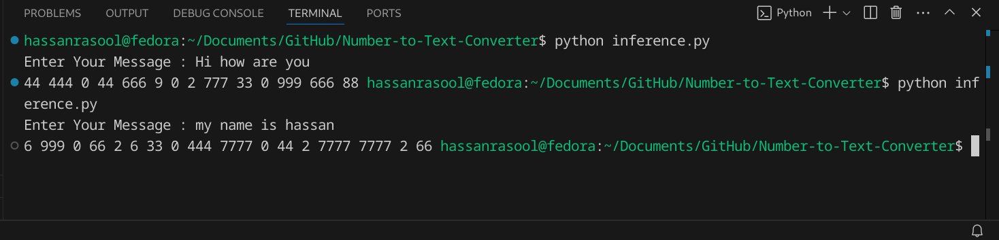

# About
Recently I had the honor of using old button phone because my android phone broke last week. It has been a nice experience except only one thing: typing messages on this thing is a work of experts only! For people like me, it is hell of a job to type simple messages too.

This tool is for the use of poeple like me. It makes your life easier by allowing you to type the message you want to send directly into the tool and the tool will give you the numbers you have to type to get the same message on the buttoned phone.

Pretty outdated, right? Still would be beneficial for someone who breaks their modern phone. Or Non-PTA phone holders, lol.

# How to use
Enter command `python inference.py` in the terminal. Enter the message you want to convert. Get results. You must have python 3 installed on your system to run this program.

# Example Usage
Output of inference.py

# Note
This tool does not include support for punctuation marks.

# Next Steps
1. GUI frontend.
2. It would be wonderful if we could connect the 2 devices such that the generated numbers are sent as inputs directly to the mobile without the user having to type it manually. This would be a good automation project for electronic engineers as well.